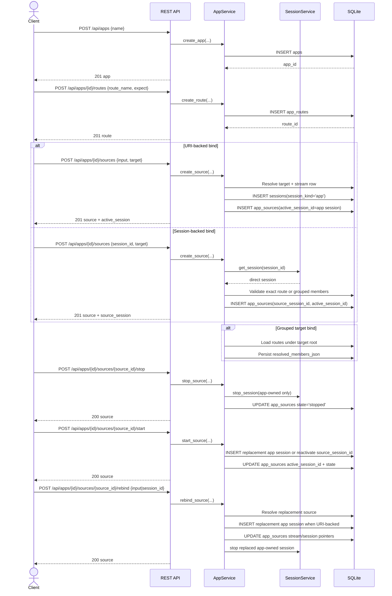

# App Route Source Sequence

## Role

- role: Mermaid sequence diagram for the current durable app/route/source REST slice
- status: active
- version: 1
- major changes:
  - 2026-03-26 added the first sequence for app create, route declaration,
    exact and session-backed source bind, grouped target resolution, and
    source stop/start/rebind lifecycle
- past tasks:
  - `2026-03-26 – Review App Route Source Persistence Slice And Reproduce Grouped Route Delete Bug`

