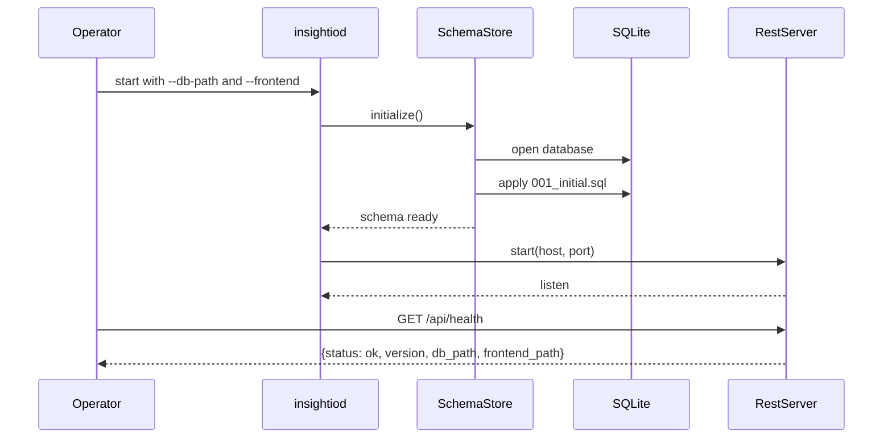

# Bootstrap Health Sequence

## Role

- role: Mermaid sequence diagram for the first runtime-tested backend slice
- status: active
- version: 1
- major changes:
  - 2026-03-25 added the bootstrap startup and health-check interaction path
- past tasks:
  - `2026-03-25 – Reintroduce Backend Bootstrap Build And Health Slice`

