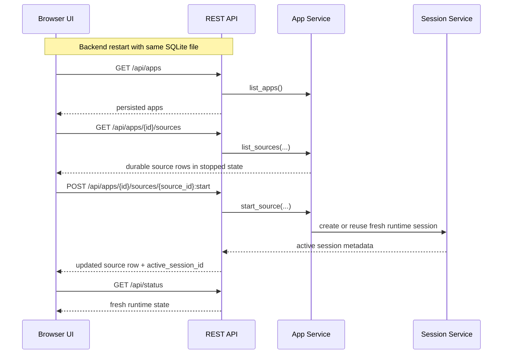

# Browser Restart Recovery Sequence

## Role

- role: Mermaid sequence diagram for the repo-native browser restart-recovery flow
- status: active
- version: 1
- major changes:
  - 2026-03-27 split the restart-specific browser recovery path out of the
    broader route-builder diagram to close the Mermaid backlog item

