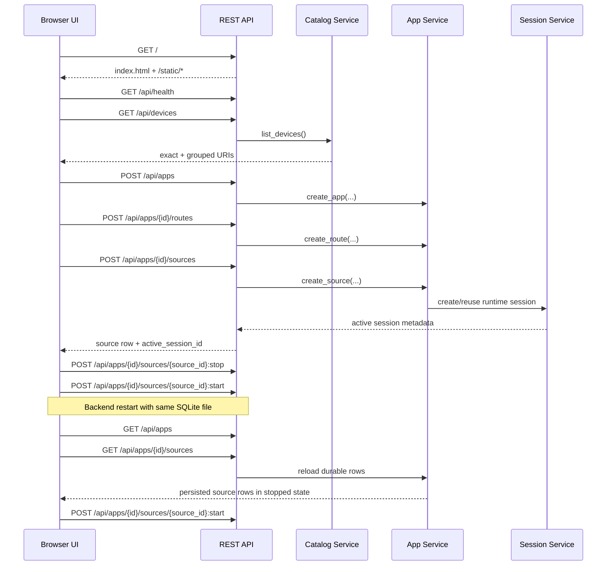

# Browser Route Builder Sequence

## Role

- role: document the repo-native browser flow for app, route, and source management
- status: active
- version: 1
- major changes:
  - 2026-03-27 added the verified browser sequence for catalog browse, app
    create, grouped or exact bind, source restart, and restart recovery

