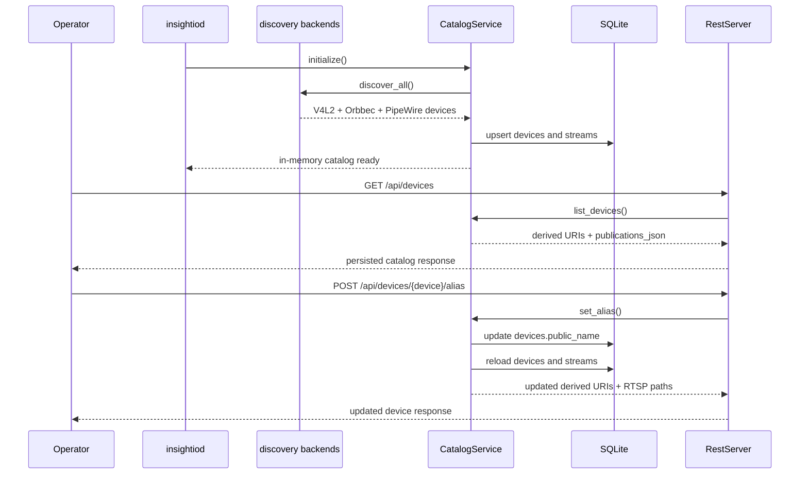

# Catalog Discovery Sequence

## Role

- role: Mermaid sequence diagram for persisted discovery refresh and catalog reads
- status: active
- version: 1
- major changes:
  - 2026-03-26 added the discovery refresh, catalog list, and alias update flow
- past tasks:
  - `2026-03-26 – Reintroduce Persisted Discovery Catalog And Alias Flow`

