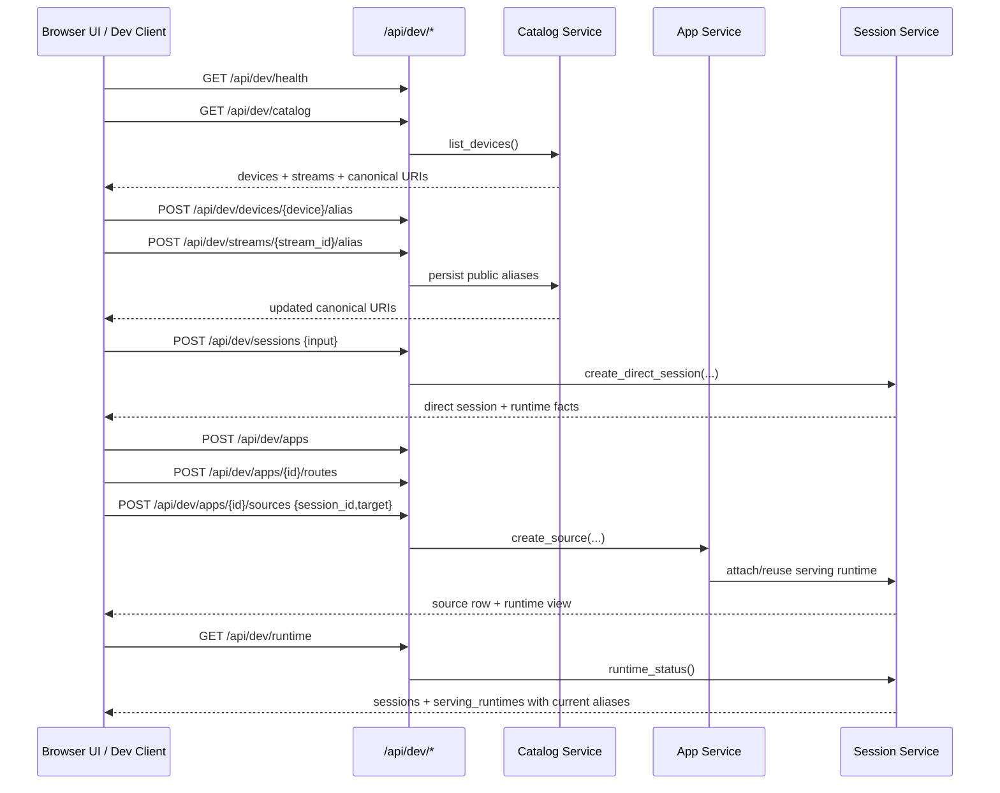

# Developer Control Surface Sequence

## Role

- role: document the thin developer-facing `/api/dev/*` flow for the current
  runtime and browser surface
- status: active
- version: 1
- major changes:
  - 2026-03-27 added the verified developer sequence for catalog browse,
    alias update, direct-session startup, session-backed app injection, and
    runtime inspection through the minimal REST facade

