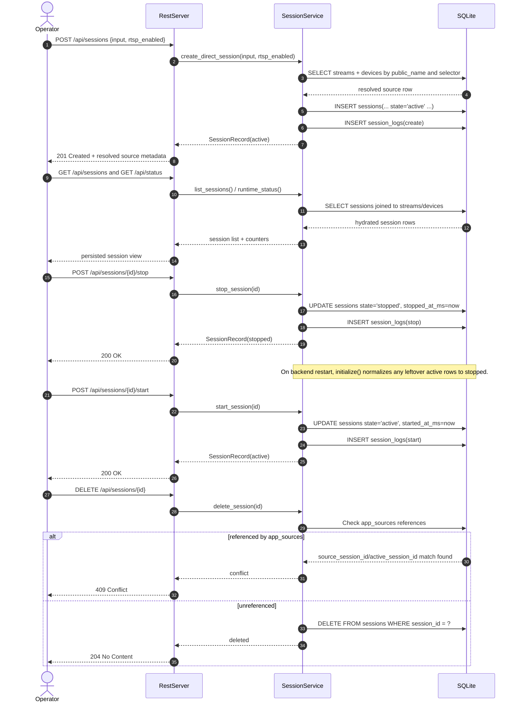

# Direct Session Sequence

## Role

- role: Mermaid sequence diagram for the checked-in direct-session REST slice
- status: active
- version: 1
- major changes:
  - 2026-03-26 added a create, status, restart, and delete sequence for the
    direct-session slice now served by `insightiod`
- past tasks:
  - `2026-03-26 – Reintroduce Direct Session REST And Status Slice`

