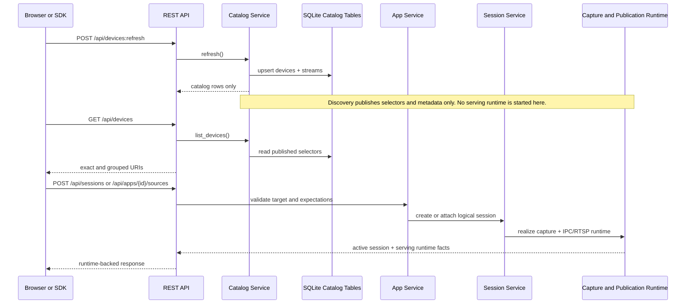

# Discovery Runtime Boundary Sequence

## Role

- role: Mermaid sequence diagram for the catalog-versus-runtime responsibility boundary
- status: active
- version: 1
- major changes:
  - 2026-03-27 added a dedicated discovery-versus-runtime sequence to make the
    no-runtime-at-discovery boundary explicit for onboarding and review

