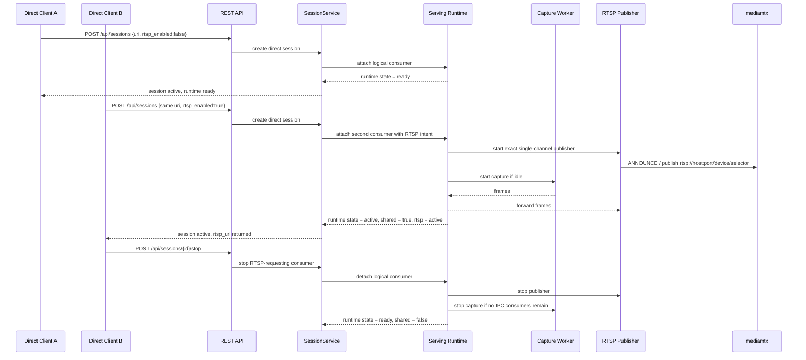

# Exact RTSP Publication Sequence

## Role

- role: Mermaid sequence for exact-source shared-runtime RTSP publication
- status: active
- version: 1
- major changes:
  - 2026-03-27 documents task-8 exact single-channel RTSP publication layered
    on top of the shared serving runtime and local IPC attach contract
- past tasks:
  - `2026-03-27 – Complete Task-7 IPC Hardening And Task-8 Exact RTSP Publication`

