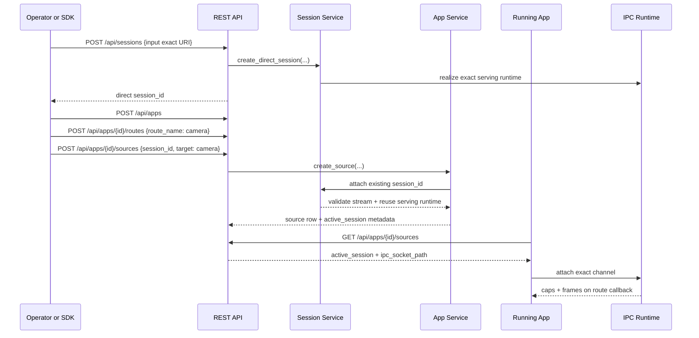

# Exact Session Attach Sequence

## Role

- role: Mermaid sequence diagram for exact `session_id` attach on the checked-in app-source surface
- status: active
- version: 1
- major changes:
  - 2026-03-27 added the exact-session attach sequence that was previously
    listed in the Mermaid backlog and is now part of the current
    implementation notes

