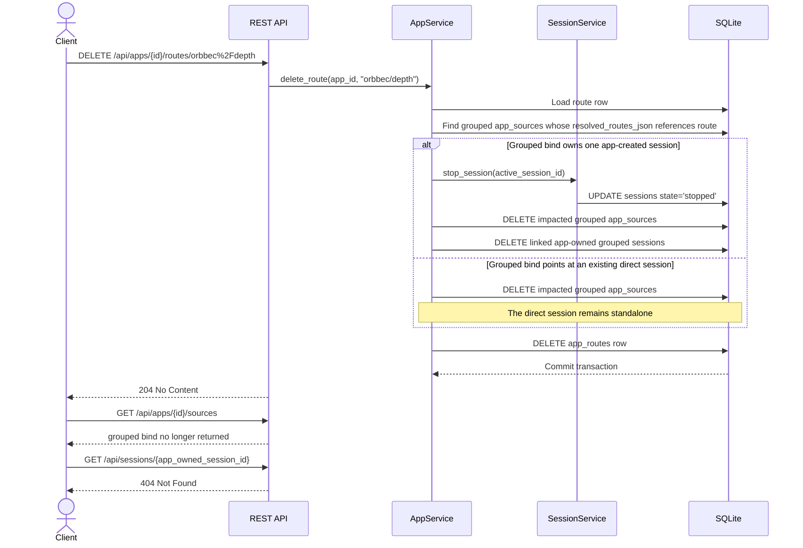

# Grouped Route Delete Sequence

## Role

- role: Mermaid sequence diagram for grouped bind cleanup when one member route
  is deleted
- status: active
- version: 1
- major changes:
  - 2026-03-26 added the first grouped-route-delete cleanup sequence after task
    5 closeout
- past tasks:
  - `2026-03-26 – Close Grouped Route Delete Cleanup And Refresh Runtime Handoff`

