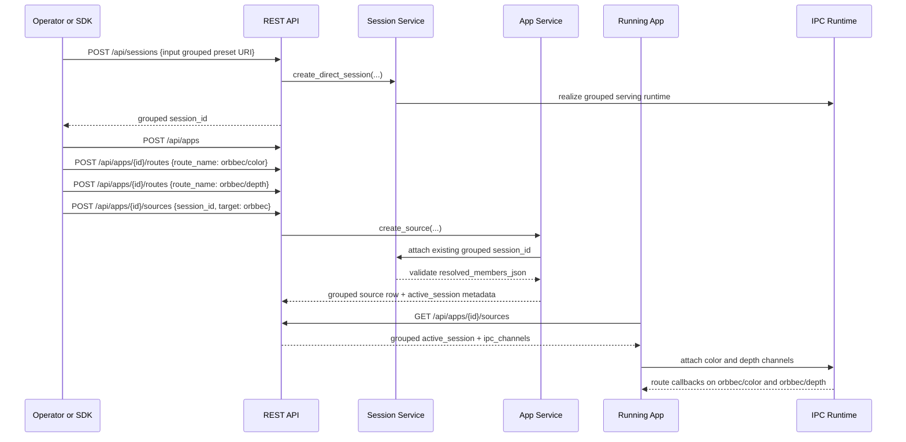

# Grouped Session Attach Sequence

## Role

- role: Mermaid sequence diagram for grouped `session_id` attach through one grouped target root
- status: active
- version: 1
- major changes:
  - 2026-03-27 added the grouped-session attach sequence that was previously
    listed in the Mermaid backlog and is now part of the checked-in task-9
    explanation set

