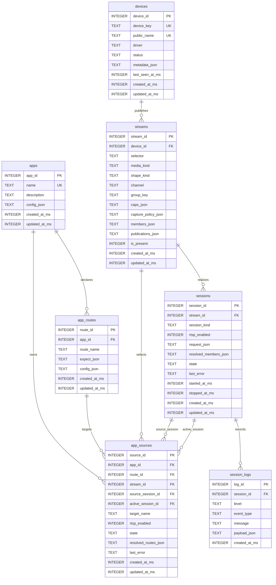

# Intent Routing ER Diagram

## Role

- role: durable-schema entity-relationship diagram for `insight-io`
- status: active
- version: 6
- major changes:
  - 2026-03-26 scoped exact app-route binds to one owning app via composite
    `(app_id, route_id)` route references
  - 2026-03-26 removed redundant `app_sources.target_kind` and
    `app_sources.source_kind`, and kept bind-kind inference on existing
    foreign-key fields instead
  - 2026-03-26 removed redundant `selector_key` from the active `streams`
    schema and kept selector identity scoped to each device
  - 2026-03-25 replaced durable `delivery_name` with `rtsp_enabled` and
    publication metadata while keeping local IPC implicit
  - 2026-03-25 replaced grouped-route public bind naming with one app-local
    `target_name`
  - 2026-03-24 replaced stored `canonical_uri` with derived public `uri`
- past tasks:
  - `2026-03-26 – Apply Selector Review And Device-Scoped Stream Keying`
  - `2026-03-26 – Take Back Redundant App-Source Kind Columns`
  - `2026-03-25 – Unify App Targets And Reframe RTSP As Publication Intent`
  - `2026-03-24 – Derive URIs, Persist Delivery Intent, And Unify App Source Binds`
  - `2026-03-24 – Add Mermaid ER Diagram For The Simplified Schema`

## Notes

- exact-route app-source rows use one app-scoped composite route reference:
  `(app_id, route_id) -> app_routes(app_id, route_id)`
- grouped app-source rows keep `route_id = NULL`, so route deletion cascades
  only exact-route bindings
