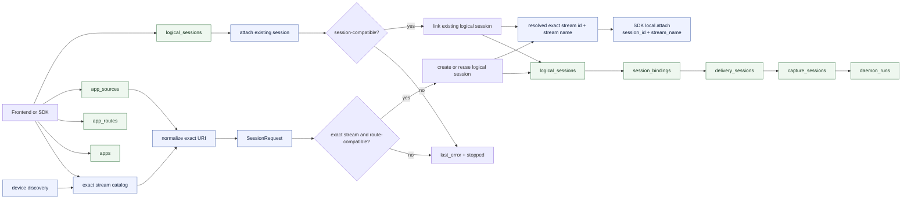

# Intent Routing Runtime

```mermaid
flowchart LR
    Discovery[device discovery] --> Catalog[exact stream catalog]
    UI[Frontend or SDK] --> Catalog
    UI --> Apps[apps]
    UI --> Routes[app_routes]
    UI --> Sources[app_sources]
    UI --> Sessions[logical_sessions]

    Sources --> Normalize[normalize exact URI]
    Sessions --> AttachExisting[attach existing session]
    Catalog --> Normalize
    Normalize --> Request[SessionRequest]
    Request --> Validate{exact stream and route-compatible?}
    AttachExisting --> ValidateExisting{session-compatible?}
    Validate -->|no| Reject[last_error + stopped]
    ValidateExisting -->|no| Reject
    Validate -->|yes| Create[create or reuse logical session]
    ValidateExisting -->|yes| Link[link existing logical session]

    Create --> Logical[logical_sessions]
    Link --> Logical
    Logical --> Bindings[session_bindings]
    Bindings --> Delivery[delivery_sessions]
    Delivery --> Capture[capture_sessions]
    Capture --> Runs[daemon_runs]

    Create --> Stream[resolved exact stream id + stream name]
    Link --> Stream
    Stream --> Attach[SDK local attach<br/>session_id + stream_name]

    classDef durable fill:#eef7ef,stroke:#3d7a4a,color:#17351f;
    classDef runtime fill:#eef2ff,stroke:#4361aa,color:#16233f;
    class Apps,Routes,Sources,Sessions,Logical,Bindings,Delivery,Capture,Runs durable;
    class Discovery,Catalog,Normalize,Request,AttachExisting,Stream,Attach runtime;
```
