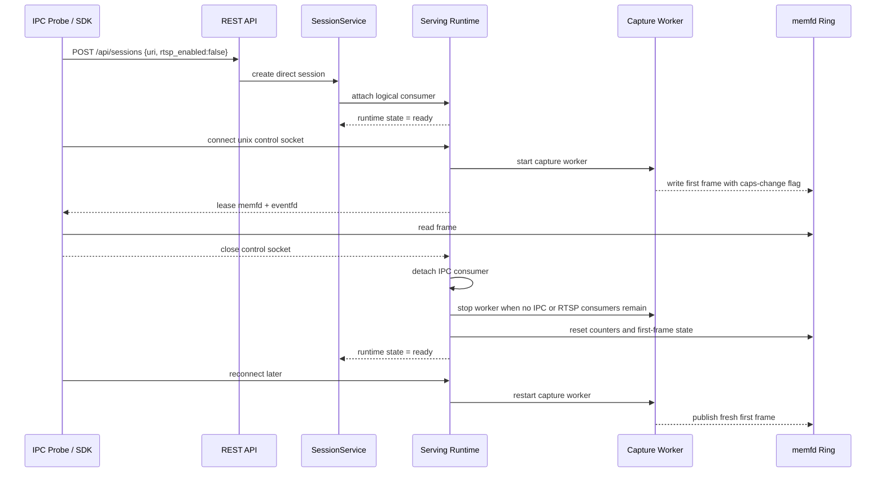

# IPC Idle Teardown Sequence

## Role

- role: Mermaid sequence for exact-source IPC attach, idle disconnect, and
  worker release
- status: active
- version: 1
- major changes:
  - 2026-03-27 documents task-7 idle-worker teardown after the last IPC
    consumer disconnects while the logical session remains active
- past tasks:
  - `2026-03-27 – Complete Task-7 IPC Hardening And Task-8 Exact RTSP Publication`

