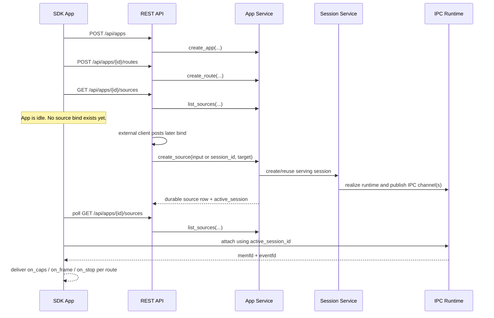

# SDK Idle Bind Sequence

## Role

- role: document the checked-in task-9 SDK idle-app plus later REST bind flow
- status: active
- version: 1
- major changes:
  - 2026-03-27 added the verified sequence for route declaration, idle startup,
    later REST bind, IPC attach, and route callback delivery

