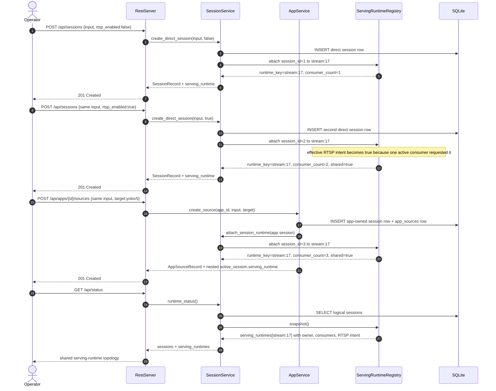

# Shared Serving Runtime Sequence

## Role

- role: Mermaid sequence diagram for the checked-in task-6 serving-runtime
  reuse slice
- status: active
- version: 1
- major changes:
  - 2026-03-26 added a shared exact-URI runtime sequence showing direct
    session reuse, one app-owned consumer attach, additive RTSP intent, and
    `GET /api/status` serving-runtime inspection
- past tasks:
  - `2026-03-26 – Add Serving Runtime Reuse And Runtime-Status Topology`

